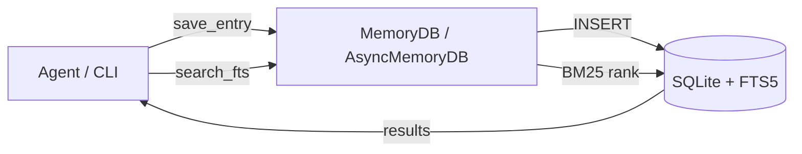

# roxabi-memory

Persistent, structured memory storage for Lyra agents and vault skills. Backed by SQLite with FTS5 full-text search.

[](https://github.com/Roxabi/roxabi-memory/actions/workflows/ci.yml)
[](https://opensource.org/licenses/MIT)
[](https://pypi.org/project/roxabi-memory/)

## Why

AI agents are stateless by default — every session starts cold. `roxabi-memory` gives Lyra and vault skills a persistent, searchable store so agents can recall past entries, surface relevant context via full-text search, and maintain isolated namespaces per agent without running a separate database server.

A single SQLite file, no infra to manage, and an API that works in both sync and async code.

## Features

### Storage

| Feature | Description |
|---------|-------------|
| SQLite + WAL mode | Single-file database, no server needed |
| Auto-migrating schema | Migrations run on every connect, no manual steps |
| Namespace isolation | Scope entries per agent while sharing global vault data |

### Search & API

| Feature | Description |
|---------|-------------|
| Full-text search | FTS5/BM25 keyword search across all entries |
| Sync API | `MemoryDB` (sqlite3) for standard Python code |
| Async API | `AsyncMemoryDB` (aiosqlite) for async frameworks |
| CLI | `rmem` command for shell-based CRUD and search |

## How it works

Entries are stored in a SQLite database with WAL mode for concurrent reads. A FTS5 virtual table mirrors every entry for sub-millisecond keyword search. Each agent uses a `namespace` to scope its entries; vault skills read across all namespaces.



## Installation

```bash
# Core library
pip install roxabi-memory

# With CLI support
pip install roxabi-memory[cli]

# With embeddings (not yet implemented)
pip install roxabi-memory[embeddings]
```

For development:

```bash
uv sync
```

## Quick Start

### Python (sync)

```python
from roxabi_memory import MemoryDB

with MemoryDB("memory.db") as db:
    entry = db.save_entry("Remember this", title="My note", category="general")
    results = db.search_fts("remember")
    print(results[0].title)  # "My note"
```

### Python (async)

```python
from roxabi_memory import AsyncMemoryDB

async with AsyncMemoryDB("memory.db") as db:
    entry_id = await db.save_entry("Remember this", title="My note")
    results = await db.search("remember", namespace="vault")
```

### CLI

```bash
export RMEM_DB=~/.roxabi/memory.db

rmem put "Remember this" --title "My note"
rmem list
rmem search "remember"
rmem get 1
rmem delete 1 -y
rmem stats
rmem export
```

## Documentation

| Document | Description |
|---|---|
| [Architecture](docs/architecture/index.md) | System overview, module map, data model |
| [Patterns](docs/architecture/patterns.md) | Recurring conventions and design patterns |
| [Ubiquitous Language](docs/architecture/ubiquitous-language.md) | Glossary of domain terms |
| [Configuration](docs/configuration.md) | Environment variables, CLI options, defaults |
| [Contributing](docs/contributing.md) | Setup, workflow, and PR process |
| [Backend Patterns](docs/standards/backend-patterns.md) | Code conventions and rules |
| [Testing](docs/standards/testing.md) | Test structure, patterns, and tooling |
| [Code Review](docs/standards/code-review.md) | Review checklist and guidelines |

## Development

```bash
uv run pytest          # Run tests
uv run ruff check .    # Lint
uv run ruff format .   # Format
```

## License

MIT
