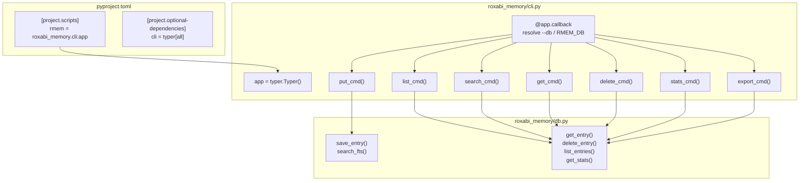
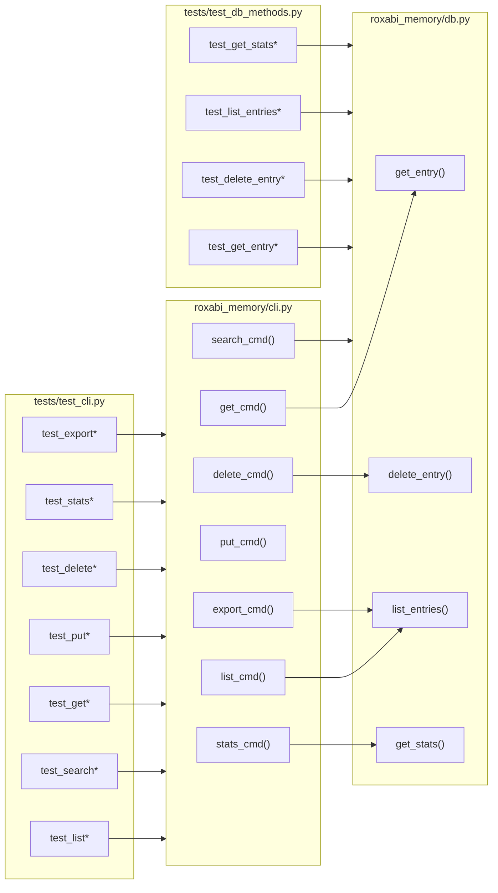

## Summary

Add a Typer-based `rmem` CLI to roxabi-memory. Three slices: (1) new MemoryDB methods + app skeleton + pyproject.toml config, (2) read commands (list/search/get/stats), (3) write commands + export. Two agents: backend-dev for implementation, tester for tests.

## Architecture





## Reference Patterns

- Test conventions: `tests/test_db.py` — `pytest.fixture` with `tmp_path`, Arrange/Act/Assert comments
- DB method pattern: `roxabi_memory/db.py` — `_conn_or_raise()` guard, `_row()` helper, `conn.commit()` after writes
- Context manager: `with MemoryDB(path) as db:` pattern for CLI commands

## Agents

| Agent | Tasks | Files |
|-------|-------|-------|
| backend-dev | 12 | `roxabi_memory/db.py`, `roxabi_memory/cli.py`, `pyproject.toml` |
| tester | 5 | `tests/test_db_methods.py`, `tests/test_cli.py` |

## Consistency Report

- Spec success criteria: 23 total
- Micro-tasks covering criteria: 23/23
- Uncovered criteria: 0
- Untraced tasks: 0

## Micro-Tasks

### Slice 1 — DB methods + scaffolding

#### T1.1 [P] — Add `get_entry` method to MemoryDB
- **Agent:** backend-dev
- **File:** `roxabi_memory/db.py`
- **Spec trace:** SC-S2.3 (get by id), SC-S2.4 (not found exits 1)
- **Phase:** RED → GREEN
- **Difficulty:** 1

```python
def get_entry(self, id: int) -> MemoryEntry | None:
    conn = self._conn_or_raise()
    row = conn.execute("SELECT * FROM entries WHERE id = ?", (id,)).fetchone()
    return self._row(row) if row else None
```

- **Verify:** `uv run pytest tests/test_db_methods.py::test_get_entry -v`
- **Expected:** PASSED

#### T1.2 [P] — Add `delete_entry` method to MemoryDB
- **Agent:** backend-dev
- **File:** `roxabi_memory/db.py`
- **Spec trace:** SC-S3.3, SC-S3.4, SC-S3.5
- **Phase:** RED → GREEN
- **Difficulty:** 1

```python
def delete_entry(self, id: int) -> bool:
    conn = self._conn_or_raise()
    cur = conn.execute("DELETE FROM entries WHERE id = ?", (id,))
    conn.commit()
    return cur.rowcount > 0
```

- **Verify:** `uv run pytest tests/test_db_methods.py::test_delete_entry -v`
- **Expected:** PASSED

#### T1.3 [P] — Add `list_entries` method to MemoryDB
- **Agent:** backend-dev
- **File:** `roxabi_memory/db.py`
- **Spec trace:** SC-S2.1, SC-S2.2, SC-S2.3, SC-S2.4
- **Phase:** RED → GREEN
- **Difficulty:** 2

```python
def list_entries(
    self,
    namespace: str | None = None,
    category: str | None = None,
    limit: int | None = 50,
    offset: int = 0,
) -> list[MemoryEntry]:
    conn = self._conn_or_raise()
    sql = "SELECT * FROM entries WHERE 1=1"
    params: list[object] = []
    if namespace:
        sql += " AND namespace = ?"
        params.append(namespace)
    if category:
        sql += " AND category = ?"
        params.append(category)
    sql += " ORDER BY id"
    if limit is not None:
        sql += " LIMIT ?"
        params.append(limit)
    sql += " OFFSET ?"
    params.append(offset)
    return [self._row(r) for r in conn.execute(sql, params).fetchall()]
```

- **Verify:** `uv run pytest tests/test_db_methods.py::test_list_entries -v`
- **Expected:** PASSED

#### T1.4 [P] — Add `get_stats` method to MemoryDB
- **Agent:** backend-dev
- **File:** `roxabi_memory/db.py`
- **Spec trace:** SC-S2.10
- **Phase:** RED → GREEN
- **Difficulty:** 1

```python
def get_stats(self) -> dict:
    conn = self._conn_or_raise()
    count = conn.execute("SELECT COUNT(*) FROM entries").fetchone()[0]
    namespaces = [r[0] for r in conn.execute("SELECT DISTINCT namespace FROM entries").fetchall()]
    categories = [r[0] for r in conn.execute("SELECT DISTINCT category FROM entries").fetchall()]
    return {"count": count, "namespaces": namespaces, "categories": categories}
```

- **Verify:** `uv run pytest tests/test_db_methods.py::test_get_stats -v`
- **Expected:** PASSED

#### T1.5 — Unit tests for new MemoryDB methods
- **Agent:** tester
- **File:** `tests/test_db_methods.py`
- **Spec trace:** SC-S1.6
- **Phase:** RED
- **Difficulty:** 2
- **Dependencies:** T1.1, T1.2, T1.3, T1.4

Tests to write:
- `test_get_entry_exists` — save then get by id
- `test_get_entry_not_found` — get non-existent id returns None
- `test_delete_entry_exists` — save, delete, verify True + gone
- `test_delete_entry_not_found` — delete non-existent id returns False
- `test_list_entries_all` — save 3, list returns 3
- `test_list_entries_filter_namespace` — filter returns only matching
- `test_list_entries_filter_category` — filter returns only matching
- `test_list_entries_pagination` — limit + offset work
- `test_list_entries_no_limit` — limit=None returns all
- `test_get_stats` — save entries in different namespaces/categories, verify counts

- **Verify:** `uv run pytest tests/test_db_methods.py -v`
- **Expected:** all PASSED

#### T1.6 — Update pyproject.toml
- **Agent:** backend-dev
- **File:** `pyproject.toml`
- **Spec trace:** SC-S1.1, SC-S1.2
- **Phase:** GREEN
- **Difficulty:** 1

Add:
```toml
[project.optional-dependencies]
cli = ["typer[all]>=0.12"]
# keep existing: embeddings = [...]

[project.scripts]
rmem = "roxabi_memory.cli:app"
```

- **Verify:** `grep -A1 '\[project.scripts\]' pyproject.toml`
- **Expected:** `rmem = "roxabi_memory.cli:app"`

#### T1.7 — Typer app skeleton with --db and --json globals
- **Agent:** backend-dev
- **File:** `roxabi_memory/cli.py`
- **Spec trace:** SC-S1.3, SC-S1.4, SC-S1.5
- **Phase:** GREEN
- **Difficulty:** 2
- **Dependencies:** T1.6

```python
import typer

app = typer.Typer(name="rmem", help="roxabi-memory CLI")

# Global state
_db_path: str = ""
_json_output: bool = False

@app.callback()
def main(
    db: str = typer.Option("", envvar="RMEM_DB", help="Path to memory database"),
    json_output: bool = typer.Option(False, "--json", help="Output as JSON"),
) -> None:
    global _db_path, _json_output
    if not db:
        typer.echo("Error: --db or RMEM_DB required", err=True)
        raise typer.Exit(code=1)
    _db_path = db
    _json_output = json_output

# ... command stubs (empty bodies, just pass) ...
```

- **Verify:** `uv run rmem --help`
- **Expected:** lists all 7 subcommands

---
**RED-GATE V1:** `uv run pytest tests/test_db_methods.py -v && uv run rmem --help`

All new DB methods pass. `rmem --help` lists subcommands. Ready for Slice 2.

---

### Slice 2 — Read commands

#### T2.1 — Implement `list_cmd`
- **Agent:** backend-dev
- **File:** `roxabi_memory/cli.py`
- **Spec trace:** SC-S2.1, SC-S2.2, SC-S2.3, SC-S2.4
- **Phase:** GREEN
- **Difficulty:** 2
- **Dependencies:** T1.7, T1.3

Flags: `--namespace`, `--category`, `--limit` (default 50), `--offset` (default 0). Table output via rich. JSON output via `--json`.

- **Verify:** `uv run pytest tests/test_cli.py::test_list -v`
- **Expected:** PASSED

#### T2.2 — Implement `search_cmd`
- **Agent:** backend-dev
- **File:** `roxabi_memory/cli.py`
- **Spec trace:** SC-S2.5, SC-S2.6
- **Phase:** GREEN
- **Difficulty:** 2
- **Dependencies:** T1.7

Argument: `query` (positional). Flag: `--namespace`. Uses existing `MemoryDB.search_fts()`.

- **Verify:** `uv run pytest tests/test_cli.py::test_search -v`
- **Expected:** PASSED

#### T2.3 — Implement `get_cmd`
- **Agent:** backend-dev
- **File:** `roxabi_memory/cli.py`
- **Spec trace:** SC-S2.7, SC-S2.8, SC-S2.9
- **Phase:** GREEN
- **Difficulty:** 2
- **Dependencies:** T1.7, T1.1

Argument: `id` (positional, int). Not found → error + exit 1. Non-integer → Typer handles type validation + exit 1.

- **Verify:** `uv run pytest tests/test_cli.py::test_get -v`
- **Expected:** PASSED

#### T2.4 — Implement `stats_cmd`
- **Agent:** backend-dev
- **File:** `roxabi_memory/cli.py`
- **Spec trace:** SC-S2.10
- **Phase:** GREEN
- **Difficulty:** 1
- **Dependencies:** T1.7, T1.4

Uses `MemoryDB.get_stats()` + `os.path.getsize(db_path)` for file size.

- **Verify:** `uv run pytest tests/test_cli.py::test_stats -v`
- **Expected:** PASSED

#### T2.5 — Integration tests for read commands
- **Agent:** tester
- **File:** `tests/test_cli.py`
- **Spec trace:** SC-S2.1–SC-S2.11
- **Phase:** RED → GREEN
- **Difficulty:** 3
- **Dependencies:** T2.1, T2.2, T2.3, T2.4

Uses `typer.testing.CliRunner`. Tests:
- `test_list_default` — table output with entries
- `test_list_namespace_filter` — only matching namespace
- `test_list_category_filter` — only matching category
- `test_list_pagination` — limit + offset
- `test_list_json` — `--json` flag outputs valid JSON
- `test_search` — FTS results
- `test_search_namespace` — search + namespace filter
- `test_search_json` — JSON output
- `test_get_found` — displays all fields
- `test_get_not_found` — exit code 1
- `test_get_json` — JSON output
- `test_stats` — shows count, namespaces, categories, file size
- `test_stats_json` — JSON output
- `test_db_env_var` — RMEM_DB works
- `test_no_db` — exit code 1

- **Verify:** `uv run pytest tests/test_cli.py -v -k "not put and not delete and not export"`
- **Expected:** all PASSED

---
**RED-GATE V2:** `uv run pytest tests/test_cli.py -v -k "not put and not delete and not export"`

All read commands work with table + JSON output. Ready for Slice 3.

---

### Slice 3 — Write commands + export

#### T3.1 — Implement `put_cmd`
- **Agent:** backend-dev
- **File:** `roxabi_memory/cli.py`
- **Spec trace:** SC-S3.1, SC-S3.2
- **Phase:** GREEN
- **Difficulty:** 1
- **Dependencies:** T1.7

Argument: `content` (positional). Flags: `--title`, `--category`, `--namespace`. Type defaults to `"note"`. Prints new entry ID.

- **Verify:** `uv run pytest tests/test_cli.py::test_put -v`
- **Expected:** PASSED

#### T3.2 — Implement `delete_cmd`
- **Agent:** backend-dev
- **File:** `roxabi_memory/cli.py`
- **Spec trace:** SC-S3.3, SC-S3.4, SC-S3.5
- **Phase:** GREEN
- **Difficulty:** 2
- **Dependencies:** T1.7, T1.2

Argument: `id` (positional, int). Flag: `--yes`. Uses `typer.confirm()` when `--yes` not set. Not found → error + exit 1.

- **Verify:** `uv run pytest tests/test_cli.py::test_delete -v`
- **Expected:** PASSED

#### T3.3 — Implement `export_cmd`
- **Agent:** backend-dev
- **File:** `roxabi_memory/cli.py`
- **Spec trace:** SC-S3.6
- **Phase:** GREEN
- **Difficulty:** 1
- **Dependencies:** T1.7, T1.3

Calls `list_entries(limit=None)`. Outputs JSON via `json.dumps` with `dataclasses.asdict`.

- **Verify:** `uv run pytest tests/test_cli.py::test_export -v`
- **Expected:** PASSED

#### T3.4 — Integration tests for write commands + export
- **Agent:** tester
- **File:** `tests/test_cli.py`
- **Spec trace:** SC-S3.1–SC-S3.7
- **Phase:** RED → GREEN
- **Difficulty:** 2
- **Dependencies:** T3.1, T3.2, T3.3

Tests:
- `test_put_minimal` — creates entry, prints ID
- `test_put_all_flags` — title, category, namespace set
- `test_delete_with_yes` — removes entry
- `test_delete_not_found` — exit code 1
- `test_delete_confirm_prompt` — prompts without `--yes`
- `test_export` — valid JSON array with all entries

- **Verify:** `uv run pytest tests/test_cli.py -v`
- **Expected:** all PASSED

---
**RED-GATE V3 (final):** `uv run pytest -v && uv run ruff check .`

All tests pass. Lint clean. Ready for PR.
