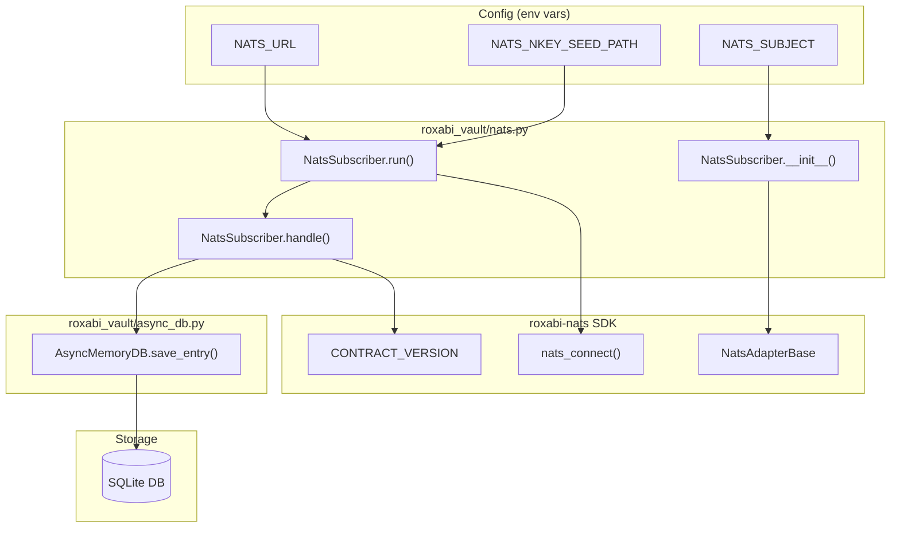
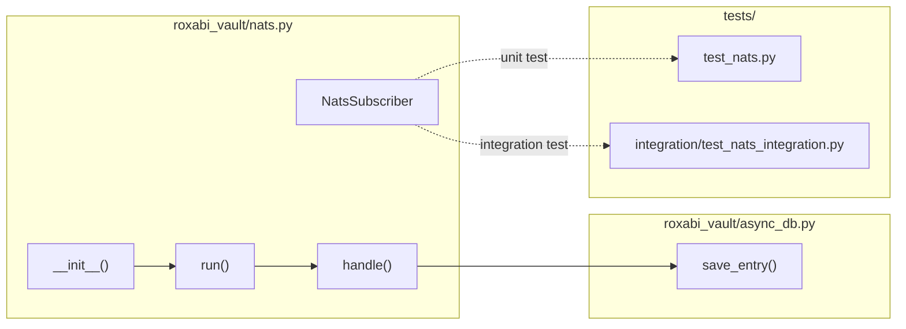

## Summary

Implement `NatsSubscriber` class that subclasses `NatsAdapterBase` from `roxabi-nats` SDK. The subscriber will consume vault write events from NATS, validate contract/schema versions, and persist entries via `AsyncMemoryDB.save_entry()`.

## Architecture

### Data Flow



### File x Function Map



## Agents

| Agent | Tasks | Files |
|-------|-------|-------|
| backend-dev | 5 | roxabi_vault/nats.py, roxabi_vault/__init__.py |
| tester | 3 | tests/test_nats.py, tests/integration/test_nats_integration.py |
| devops | 2 | pyproject.toml, docker-compose.nats.yml |

## Consistency Report

- Criteria covered: 9/9
- Uncovered criteria: none
- Tasks without spec backing: none
- Gold plating exemptions applied: 0

## Micro-Tasks

### Slice V1: Dependency + config

#### Task 1: Add roxabi-nats dependency to pyproject.toml [P] → devops
- **File:** `pyproject.toml`
- **Snippet:**
```toml
[tool.uv.sources]
roxabi-nats = { git = "https://github.com/Roxabi/lyra.git", subdirectory = "packages/roxabi-nats", tag = "roxabi-nats/v0.1.0" }

[project.dependencies]
roxabi-nats = ">=0.1.0"
```
- **Verify:** `uv sync && uv run python -c "from roxabi_nats import NatsAdapterBase; print('ok')"` (ready)
- **Expected:** `ok`
- **Time:** 2 min
- **Difficulty:** 1
- **Traces:** SC-1
- **Phase:** RED

#### Task 2: Create NatsSubscriber class skeleton → backend-dev
- **File:** `roxabi_vault/nats.py`
- **Snippet:**
```python
"""NATS subscriber for vault write events."""

from roxabi_nats import NatsAdapterBase

class NatsSubscriber(NatsAdapterBase):
    """Subscribe to vault write events from Lyra NATS bus."""

    def __init__(self) -> None:
        super().__init__(
            subject="lyra.vault.write",
            queue_group="roxabi-vault",
            envelope_name="VaultWrite",
            schema_version=1,
        )

    async def handle(self, msg, payload: dict) -> None:
        """Process vault write message."""
        raise NotImplementedError
```
- **Verify:** `uv run python -c "from roxabi_vault.nats import NatsSubscriber; print('ok')"` (ready)
- **Expected:** `ok`
- **Time:** 3 min
- **Difficulty:** 2
- **Traces:** SC-2, N1
- **Phase:** RED

#### RED-GATE: RED complete V1 → tester
- **Verify:** Tasks 1-2 marked complete
- **Phase:** RED-GATE

### Slice V2: Connection + subscription

#### Task 3: Implement run() with env config loading → backend-dev
- **File:** `roxabi_vault/nats.py`
- **Snippet:**
```python
import os

async def run(self, nats_url: str | None = None) -> None:
    """Connect to NATS and start subscription loop."""
    url = nats_url or os.environ.get("NATS_URL")
    if not url:
        raise ValueError("NATS_URL env var required")
    await super().run(url)
```
- **Verify:** `uv run ruff check roxabi_vault/nats.py` (ready)
- **Expected:** No errors
- **Time:** 3 min
- **Difficulty:** 2
- **Traces:** SC-4, N2
- **Phase:** GREEN

#### Task 4: Add subject configuration from env → backend-dev
- **File:** `roxabi_vault/nats.py`
- **Snippet:**
```python
def __init__(self, subject: str | None = None) -> None:
    subject = subject or os.environ.get("NATS_SUBJECT", "lyra.vault.write")
    super().__init__(
        subject=subject,
        queue_group="roxabi-vault",
        envelope_name="VaultWrite",
        schema_version=1,
    )
```
- **Verify:** `uv run ruff check roxabi_vault/nats.py` (ready)
- **Expected:** No errors
- **Time:** 2 min
- **Difficulty:** 2
- **Traces:** SC-7, N1
- **Phase:** GREEN

#### RED-GATE: RED complete V2 → tester
- **Verify:** Tasks 3-4 marked complete
- **Phase:** RED-GATE

### Slice V3: Message handling

#### Task 5: Implement handle() with field mapping → backend-dev
- **File:** `roxabi_vault/nats.py`
- **Snippet:**
```python
from .async_db import AsyncMemoryDB

class NatsSubscriber(NatsAdapterBase):
    def __init__(self, db: AsyncMemoryDB, subject: str | None = None) -> None:
        self._db = db
        # ... rest of __init__

    async def handle(self, msg, payload: dict) -> None:
        """Process vault write message, store in DB."""
        await self._db.save_entry(
            content=payload["content"],
            title=payload.get("name", ""),
            category=payload.get("category", "general"),
            metadata=payload.get("metadata"),
            type="note",
            namespace="vault",
        )
```
- **Verify:** `uv run ruff check roxabi_vault/nats.py` (ready)
- **Expected:** No errors
- **Time:** 5 min
- **Difficulty:** 3
- **Traces:** SC-3, N3→A1
- **Phase:** GREEN

#### Task 6: Add unit tests for NatsSubscriber → tester
- **File:** `tests/test_nats.py`
- **Snippet:**
```python
"""Unit tests for NatsSubscriber."""

import pytest
from roxabi_vault.nats import NatsSubscriber

class TestNatsSubscriber:
    def test_init_defaults(self):
        """Test default subject and queue_group."""
        sub = NatsSubscriber.__new__(NatsSubscriber)
        assert sub.subject == "lyra.vault.write"

    def test_init_custom_subject(self, monkeypatch):
        """Test custom subject from env."""
        monkeypatch.setenv("NATS_SUBJECT", "custom.subject")
        # test subject override
```
- **Verify:** `uv run pytest tests/test_nats.py -v` (deferred)
- **Expected:** Tests pass
- **Time:** 5 min
- **Difficulty:** 3
- **Traces:** SC-2, SC-7
- **Phase:** GREEN

#### Task 7: Export NatsSubscriber from __init__.py → backend-dev
- **File:** `roxabi_vault/__init__.py`
- **Snippet:**
```python
from .nats import NatsSubscriber

__all__ = [
    # ... existing exports
    "NatsSubscriber",
]
```
- **Verify:** `uv run python -c "from roxabi_vault import NatsSubscriber; print('ok')"` (ready)
- **Expected:** `ok`
- **Time:** 1 min
- **Difficulty:** 1
- **Traces:** SC-2
- **Phase:** GREEN

#### RED-GATE: RED complete V3 → tester
- **Verify:** Tasks 5-7 marked complete
- **Phase:** RED-GATE

### Slice V4: Integration test

#### Task 8: Create docker-compose.nats.yml fixture [P] → devops
- **File:** `tests/fixtures/docker-compose.nats.yml`
- **Snippet:**
```yaml
services:
  nats:
    image: nats:2.10
    ports:
      - "4222:4222"
    command: ["-m", "8222"]
    healthcheck:
      test: ["CMD", "wget", "-q", "--spider", "http://localhost:8222/healthz"]
      interval: 1s
      timeout: 3s
      retries: 5
```
- **Verify:** `test -f tests/fixtures/docker-compose.nats.yml` (ready)
- **Expected:** File exists
- **Time:** 2 min
- **Difficulty:** 2
- **Traces:** SC-8
- **Phase:** RED

#### Task 9: Create integration test → tester
- **File:** `tests/integration/test_nats_integration.py`
- **Snippet:**
```python
"""Integration test for NatsSubscriber against real NATS."""

import pytest

@pytest.fixture
def nats_server(docker_services):
    """Start NATS container and return URL."""
    docker_services.start("nats")
    return "nats://localhost:4222"

@pytest.mark.asyncio
async def test_subscriber_receives_message(nats_server, tmp_path):
    """Test full flow: connect, receive message, store in DB."""
    from roxabi_vault import AsyncMemoryDB, NatsSubscriber

    db_path = tmp_path / "test.db"
    async with AsyncMemoryDB(db_path) as db:
        subscriber = NatsSubscriber(db)
        # ... test message handling
```
- **Verify:** `uv run pytest tests/integration/test_nats_integration.py -v --docker-compose-no-build` (deferred)
- **Expected:** Tests pass
- **Time:** 8 min
- **Difficulty:** 4
- **Traces:** SC-8
- **Phase:** GREEN

#### RED-GATE: RED complete V4 → tester
- **Verify:** Tasks 8-9 marked complete
- **Phase:** RED-GATE

## Task IDs

<!-- Generated by /plan. Used by /implement to resume tasks on session restart. -->
- T1: 8 — Add roxabi-nats dependency to pyproject.toml
- T2: 9 — Create NatsSubscriber class skeleton
- T3: 10 — Implement run() with env config loading
- T4: 11 — Add subject configuration from env
- T5: 12 — Implement handle() with field mapping
- T6: 13 — Add unit tests for NatsSubscriber
- T7: 14 — Export NatsSubscriber from __init__.py
- T8: 15 — Create docker-compose.nats.yml fixture
- T9: 16 — Create integration test
