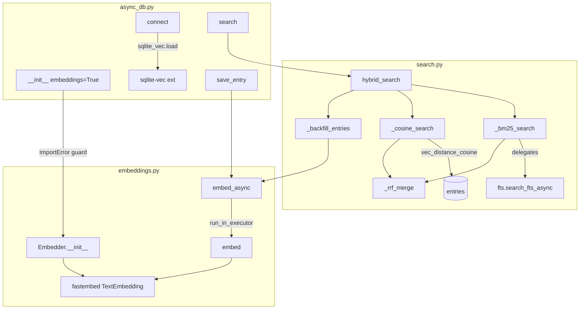
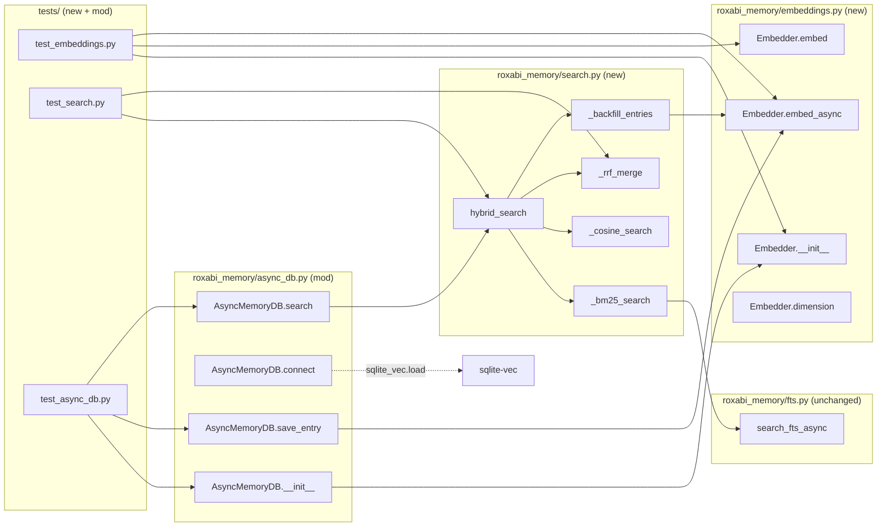

## Summary

Implement hybrid search combining BM25 (existing FTS5) + cosine similarity (fastembed ONNX + sqlite-vec) with RRF merge in roxabi-memory. Three slices: Embedder module → cosine search + RRF → AsyncMemoryDB integration + backfill.

## Architecture

### Data Flow



### File x Function Map



## Agents

| Agent | Tasks | Files |
|-------|-------|-------|
| backend-dev | 14 | `embeddings.py`, `search.py`, `async_db.py`, `__init__.py` |
| tester | 4 | `test_embeddings.py`, `test_search.py`, `test_async_db.py` |

## Consistency Report

| Metric | Value |
|--------|-------|
| Success criteria covered | 12/12 |
| Uncovered criteria | 0 |
| Untraced tasks | 0 |

## Micro-Tasks

### Slice 1 — Embedder Module

#### T1 [RED] Write test: embed() returns 384-dim float32 bytes `[P]`
- **File:** `tests/test_embeddings.py`
- **Agent:** tester
- **Spec trace:** SC-2 (model loads once), SC-3 (run_in_executor)
- **Difficulty:** 2
- **Description:** Create test file. Test that `Embedder().embed("hello world")` returns `bytes` of length `384 * 4 = 1536`. Test that a second call returns same length (model reused, not reloaded).
- **Code snippet:**
  ```python
  from roxabi_memory.embeddings import Embedder

  def test_embed_returns_float32_blob():
      e = Embedder()
      result = e.embed("hello world")
      assert isinstance(result, bytes)
      assert len(result) == 384 * 4  # float32 x 384

  def test_model_loaded_once():
      e = Embedder()
      e.embed("first")
      model_id = id(e._model)
      e.embed("second")
      assert id(e._model) == model_id
  ```
- **Verify:** `uv run pytest tests/test_embeddings.py -x 2>&1 | tail -5`
- **Expected output:** FAILED (no implementation yet)

#### T2 [RED] Write test: embed_async() uses run_in_executor `[P]`
- **File:** `tests/test_embeddings.py`
- **Agent:** tester
- **Spec trace:** SC-3 (embed_async + run_in_executor)
- **Difficulty:** 2
- **Description:** Async test that `embed_async()` returns same result as `embed()` and does not block event loop.
- **Code snippet:**
  ```python
  async def test_embed_async_returns_same_as_sync():
      e = Embedder()
      sync_result = e.embed("test text")
      async_result = await e.embed_async("test text")
      assert sync_result == async_result
  ```
- **Verify:** `uv run pytest tests/test_embeddings.py::test_embed_async_returns_same_as_sync -x 2>&1 | tail -5`
- **Expected output:** FAILED (no implementation yet)

#### T3 [GREEN] Implement Embedder class
- **File:** `roxabi_memory/embeddings.py`
- **Agent:** backend-dev
- **Spec trace:** SC-2, SC-3, SC-8 (ImportError)
- **Difficulty:** 3
- **Description:** Create `Embedder` class wrapping fastembed `TextEmbedding`. Model: `BAAI/bge-small-en-v1.5`. `embed(text)` returns float32 BLOB via `struct.pack`. `embed_async(text)` uses `asyncio.get_event_loop().run_in_executor(None, self.embed, text)`. `ImportError` guard at import time.
- **Code snippet:**
  ```python
  import asyncio
  import struct
  from typing import TYPE_CHECKING

  try:
      from fastembed import TextEmbedding
  except ImportError:
      raise ImportError("fastembed is required: pip install roxabi-memory[embeddings]")

  class Embedder:
      MODEL_NAME = "BAAI/bge-small-en-v1.5"
      DIMENSION = 384

      def __init__(self) -> None:
          self._model = TextEmbedding(model_name=self.MODEL_NAME)

      @property
      def dimension(self) -> int:
          return self.DIMENSION

      def embed(self, text: str) -> bytes:
          vectors = list(self._model.embed([text]))
          return struct.pack(f"{self.DIMENSION}f", *vectors[0])

      async def embed_async(self, text: str) -> bytes:
          loop = asyncio.get_running_loop()
          return await loop.run_in_executor(None, self.embed, text)
  ```
- **Verify:** `uv run pytest tests/test_embeddings.py -x 2>&1 | tail -5`
- **Expected output:** All tests PASSED

#### T4 [RED-GATE] Slice 1 gate — all embedder tests pass
- **Verify:** `uv run pytest tests/test_embeddings.py -v 2>&1 | tail -10`
- **Expected output:** All PASSED, 0 FAILED

---

### Slice 2 — Cosine Search + RRF

#### T5 [RED] Write test: _rrf_merge with known inputs `[P]`
- **File:** `tests/test_search.py`
- **Agent:** tester
- **Spec trace:** SC-1 (RRF merge)
- **Difficulty:** 2
- **Description:** Test RRF merge with two known lists. Verify ordinal-position-based scoring with k=60. Entry in both lists scores higher than entry in one list.
- **Code snippet:**
  ```python
  from roxabi_memory.search import _rrf_merge

  def test_rrf_merge_ranks_dual_presence_higher():
      bm25 = [{"id": 1}, {"id": 2}, {"id": 3}]
      cosine = [{"id": 2}, {"id": 4}, {"id": 1}]
      merged = _rrf_merge(bm25, cosine, k=60)
      ids = [r["id"] for r in merged]
      # id=2 is rank 2 in bm25 + rank 1 in cosine → highest RRF
      # id=1 is rank 1 in bm25 + rank 3 in cosine → second
      assert ids[0] == 2
      assert ids[1] == 1
  ```
- **Verify:** `uv run pytest tests/test_search.py::test_rrf_merge_ranks_dual_presence_higher -x 2>&1 | tail -5`
- **Expected output:** FAILED (no implementation)

#### T6 [RED] Write test: _cosine_search filters NULL embeddings `[P]`
- **File:** `tests/test_search.py`
- **Agent:** tester
- **Spec trace:** SC-4 (NULL handling)
- **Difficulty:** 3
- **Description:** Create a DB with 2 entries — one with embedding, one without. Verify `_cosine_search` returns only the entry with embedding.
- **Code snippet:**
  ```python
  async def test_cosine_search_excludes_null_embeddings(tmp_path):
      # Setup: create DB, insert entry with embedding + entry without
      # Call _cosine_search
      # Assert: only embedded entry returned
  ```
- **Verify:** `uv run pytest tests/test_search.py::test_cosine_search_excludes_null_embeddings -x 2>&1 | tail -5`
- **Expected output:** FAILED (no implementation)

#### T7 [RED] Write test: hybrid_search returns merged ranking
- **File:** `tests/test_search.py`
- **Agent:** tester
- **Spec trace:** SC-1, SC-4, SC-10 (limit on final)
- **Difficulty:** 3
- **Description:** Insert entries with and without embeddings. Run `hybrid_search`. Verify: (a) entries with embeddings rank higher (dual-list presence), (b) NULL-embedding entries still present via BM25, (c) result count respects `limit`.

#### T8 [GREEN] Implement search.py — _bm25_search, _cosine_search, _rrf_merge, hybrid_search
- **File:** `roxabi_memory/search.py`
- **Agent:** backend-dev
- **Spec trace:** SC-1, SC-4, SC-10
- **Difficulty:** 4
- **Description:** Create `search.py`. `_bm25_search` delegates to `search_fts_async()` from `fts.py`. `_cosine_search` queries entries with `WHERE embedding IS NOT NULL` using `vec_distance_cosine`. `_rrf_merge` implements RRF with k=60 using ordinal positions. `hybrid_search` orchestrates both, merges, applies final `limit`.
- **Code snippet:**
  ```python
  from .fts import search_fts_async

  _COSINE_SQL = """
      SELECT e.id, e.category, e.type, e.title, e.content,
             e.namespace, e.metadata, e.created_at, e.updated_at,
             vec_distance_cosine(e.embedding, ?) AS distance
      FROM entries e
      WHERE e.embedding IS NOT NULL
        AND (e.namespace = ? OR e.namespace = 'vault')
      ORDER BY distance
      LIMIT ?
  """

  async def _bm25_search(db, query, namespace, limit):
      return await search_fts_async(db, query, namespace, limit)

  async def _cosine_search(db, query_embedding, namespace, limit):
      async with db.execute(_COSINE_SQL, (query_embedding, namespace, limit)) as cur:
          rows = await cur.fetchall()
          cols = [d[0] for d in cur.description]
      return [dict(zip(cols, r)) for r in rows]

  def _rrf_merge(bm25_results, cosine_results, k=60):
      scores = {}
      docs = {}
      for rank, doc in enumerate(bm25_results, 1):
          did = doc["id"]
          scores[did] = scores.get(did, 0) + 1 / (k + rank)
          docs[did] = doc
      for rank, doc in enumerate(cosine_results, 1):
          did = doc["id"]
          scores[did] = scores.get(did, 0) + 1 / (k + rank)
          docs[did] = doc
      return [docs[did] for did, _ in sorted(scores.items(), key=lambda x: -x[1])]

  async def hybrid_search(db, embedder, query, namespace, limit=5):
      fetch = limit * 2
      bm25 = await _bm25_search(db, query, namespace, fetch)
      query_emb = await embedder.embed_async(query)
      cosine = await _cosine_search(db, query_emb, namespace, fetch)
      merged = _rrf_merge(bm25, cosine, k=60)
      return merged[:limit]
  ```
- **Verify:** `uv run pytest tests/test_search.py -x 2>&1 | tail -5`
- **Expected output:** All tests PASSED

#### T9 [RED-GATE] Slice 2 gate — all search tests pass
- **Verify:** `uv run pytest tests/test_search.py -v 2>&1 | tail -10`
- **Expected output:** All PASSED, 0 FAILED

---

### Slice 3 — AsyncMemoryDB Integration + Backfill

#### T10 [RED] Write test: AsyncMemoryDB(embeddings=True) save_entry stores embedding
- **File:** `tests/test_async_db.py`
- **Agent:** tester
- **Spec trace:** SC-5, SC-6 (embeddings flag, embed_async in save)
- **Difficulty:** 3
- **Description:** Create `AsyncMemoryDB(path, embeddings=True)`. Save an entry. Verify embedding column is non-NULL in DB.

#### T11 [RED] Write test: search returns hybrid results
- **File:** `tests/test_async_db.py`
- **Agent:** tester
- **Spec trace:** SC-1, SC-5, SC-12 (integration test)
- **Difficulty:** 3
- **Description:** Save entries with embeddings enabled. Search. Verify results are ranked (semantically similar entry ranks high even if keyword match is weaker).

#### T12 [RED] Write test: backfill updates NULL embeddings
- **File:** `tests/test_async_db.py`
- **Agent:** tester
- **Spec trace:** SC-7 (backfill)
- **Difficulty:** 3
- **Description:** Insert entry without embedding (embeddings=False), then create new DB instance with embeddings=True, search for it. Wait briefly. Verify embedding column becomes non-NULL.

#### T13 [RED] Write test: embeddings=False preserves BM25-only
- **File:** `tests/test_async_db.py`
- **Agent:** tester
- **Spec trace:** SC-5, SC-11 (backward compat)
- **Difficulty:** 2
- **Description:** Create `AsyncMemoryDB(path)` (default embeddings=False). Save + search. Verify works exactly as before — no embedding stored, BM25 results returned.

#### T14 [RED] Write test: sqlite-vec loaded in connect()
- **File:** `tests/test_async_db.py`
- **Agent:** tester
- **Spec trace:** SC-9 (extension loading)
- **Difficulty:** 2
- **Description:** Create `AsyncMemoryDB(path, embeddings=True)`, connect. Verify sqlite-vec functions available by running a simple `SELECT vec_distance_cosine(X'...', X'...')` query.

#### T15 [RED] Write test: ImportError when deps missing
- **File:** `tests/test_embeddings.py`
- **Agent:** tester
- **Spec trace:** SC-8 (ImportError)
- **Difficulty:** 2
- **Description:** Mock `fastembed` as unavailable. Verify `ImportError` with clear message.

#### T16 [GREEN] Modify async_db.py — embeddings param, hybrid search, backfill
- **File:** `roxabi_memory/async_db.py`
- **Agent:** backend-dev
- **Spec trace:** SC-5, SC-6, SC-7, SC-9
- **Difficulty:** 4
- **Description:** Add `embeddings: bool = False` to `__init__`. On `True`: import `Embedder`, create instance. In `connect()`: load sqlite-vec via `_execute`. In `save_entry()`: call `embed_async()`, store BLOB. In `search()`: delegate to `hybrid_search()` from `search.py`. Add `_backfill_entries` as fire-and-forget task. Handle `OperationalError` → `RuntimeError` for extension load.

#### T17 [GREEN] Update __init__.py exports
- **File:** `roxabi_memory/__init__.py`
- **Agent:** backend-dev
- **Spec trace:** —
- **Difficulty:** 1
- **Description:** Add `Embedder` and `hybrid_search` to `__all__` exports with conditional import (only when embeddings deps available).

#### T18 [RED-GATE] Full test suite passes
- **Verify:** `uv run pytest -v 2>&1 | tail -20`
- **Expected output:** All PASSED (existing + new), 0 FAILED
