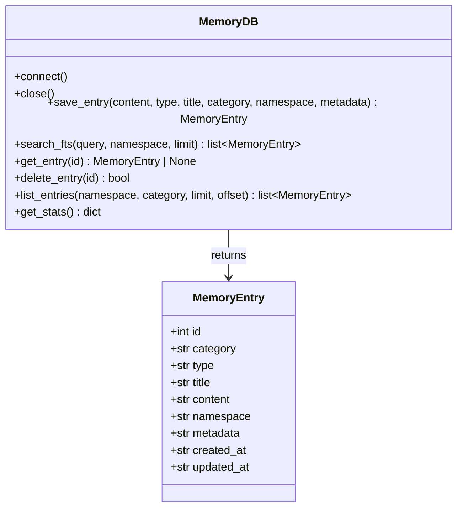
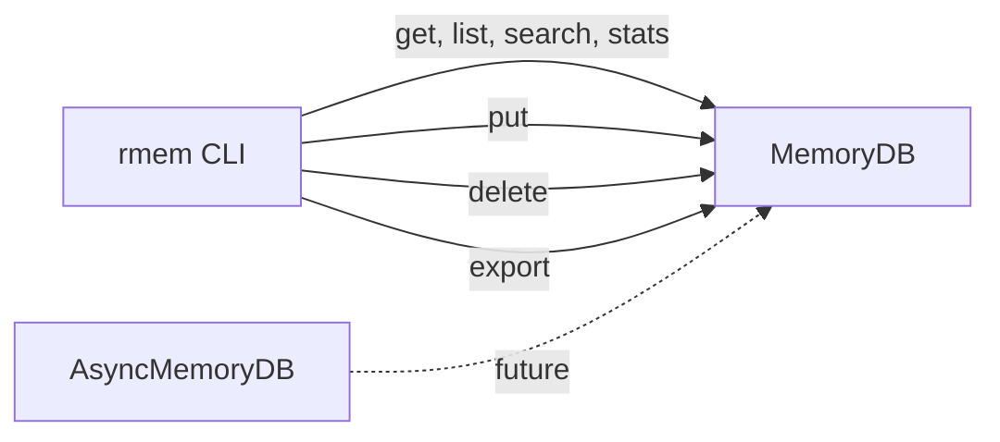

## Context

Promoted from [frame](../frames/2-add-cli-frame.mdx). roxabi-memory has no CLI. Developers must write Python scripts for simple DB operations. voiceCLI and imageCLI already ship Typer-based CLIs.

## Goal

Provide a `rmem` CLI command that exposes core MemoryDB operations (list, search, get, put, delete, stats, export) for terminal-based inspection and administration of memory databases.

## Users

- **Primary:** Developers debugging/inspecting memory databases
- **Secondary:** Lyra agent operators running admin tasks from the terminal

## Expected Behavior

A developer installs roxabi-memory with the `cli` extra (`pip install roxabi-memory[cli]`) and gets the `rmem` command. They set `RMEM_DB=/path/to/memory.db` (or pass `--db` per-call). They can then:

1. `rmem list` — see entries in a table (default limit: 50), optionally filtered by `--namespace` or `--category`, with `--limit` / `--offset` for pagination
2. `rmem search "query"` — full-text search ranked by relevance, optionally filtered by `--namespace`
3. `rmem get 42` — retrieve a single entry by ID, displayed with all fields
4. `rmem put "some content" --title "My Note" --category general` — create a new entry, prints the new ID. `--type` defaults to `"note"` (intentionally not exposed as a flag for simplicity)
5. `rmem delete 42` — remove an entry by ID. Prompts for confirmation; `--yes` skips the prompt
6. `rmem stats` — show entry count, namespace list, category list, DB file size
7. `rmem export` — dump all entries to stdout as JSON (always JSON, no `--format` flag)

**Output format:** Commands that display entries (list, search, get, stats) default to a human-readable table. Adding `--json` switches to JSON output for scripting. `put` and `delete` output plain text messages (not affected by `--json`). `export` always outputs JSON.

**Connection lifecycle:** Each command opens and closes its own `MemoryDB` context via `with MemoryDB(db_path) as db:`. No shared state or module-level singletons.

**Error handling:** Invalid or non-integer IDs, not-found entries, and invalid DB paths produce a clear error message and exit with code 1.

## Data Model & Consumers

No new data model — the CLI consumes the existing `entries` table and `MemoryEntry` dataclass.

| Consumer | Fields | When | Status |
|----------|--------|------|--------|
| `rmem list` | all MemoryEntry fields | on invocation | this issue |
| `rmem search` | all MemoryEntry fields | on invocation | this issue |
| `rmem get` | all MemoryEntry fields | on invocation | this issue |
| `rmem put` | save_entry params -> returns id | on invocation | this issue |
| `rmem delete` | id | on invocation | this issue |
| `rmem stats` | count, namespace list, category list, file size | on invocation | this issue |
| `rmem export` | all MemoryEntry fields | on invocation | this issue |

## Breadboard

### CLI Module (`roxabi_memory/cli.py`)

| Affordance | Type | Handler | Data |
|------------|------|---------|------|
| U1: `--db` option | global option / env var | Typer callback | `RMEM_DB` env var fallback |
| U2: `--json` flag | global option | output formatter | switches table -> JSON for list/search/get/stats |
| N1: `rmem list` | command | `list_cmd()` | `MemoryDB.list_entries()` |
| N2: `rmem search <query>` | command | `search_cmd()` | `MemoryDB.search_fts()` |
| N3: `rmem get <id>` | command | `get_cmd()` | `MemoryDB.get_entry()` |
| N4: `rmem put <content>` | command | `put_cmd()` | `MemoryDB.save_entry()` |
| N5: `rmem delete <id>` | command | `delete_cmd()` | `MemoryDB.delete_entry()` |
| N6: `rmem stats` | command | `stats_cmd()` | `MemoryDB.get_stats()` |
| N7: `rmem export` | command | `export_cmd()` | `MemoryDB.list_entries(limit=None)` |

### New MemoryDB Methods

| Method | Signature | Notes |
|--------|-----------|-------|
| `get_entry` | `(id: int) -> MemoryEntry \| None` | SELECT by id |
| `delete_entry` | `(id: int) -> bool` | DELETE by id, return True if row existed |
| `list_entries` | `(namespace: str \| None = None, category: str \| None = None, limit: int \| None = 50, offset: int = 0) -> list[MemoryEntry]` | SELECT with optional filters + pagination. `limit=None` fetches all rows (used by export). |
| `get_stats` | `() -> dict` | Returns `{"count": int, "namespaces": list[str], "categories": list[str]}`. Uses `SELECT COUNT(*)`, `SELECT DISTINCT namespace`, `SELECT DISTINCT category`. DB file size computed by CLI via `os.path.getsize()`. |

## Slices

| # | Slice | Affordances | Demo |
|---|-------|-------------|------|
| 1 | DB methods + scaffolding | New MemoryDB methods (get, delete, list, stats) + Typer app skeleton + `--db`/`--json` globals + entry point in pyproject.toml + `typer[all]` optional dep | `rmem --help` prints usage |
| 2 | Read commands | N1 (list), N2 (search), N3 (get), N6 (stats) | `rmem list --db test.db` shows entries |
| 3 | Write commands + export | N4 (put), N5 (delete), N7 (export) | `rmem put "hello" --db test.db` creates entry |

## Success Criteria

### Slice 1 — Scaffolding
- [ ] `typer[all]` added to `[project.optional-dependencies]` under a `cli` extra
- [ ] `[project.scripts]` entry: `rmem = "roxabi_memory.cli:app"`
- [ ] `rmem --help` prints usage with all 7 subcommands
- [ ] `RMEM_DB` env var is used when `--db` is not provided
- [ ] Missing `--db` and `RMEM_DB` produces a clear error message and exits with code 1
- [ ] All new MemoryDB methods have unit tests

### Slice 2 — Read commands
- [ ] `rmem list --db <path>` outputs entries in table format (default limit 50)
- [ ] `rmem list --db <path> --namespace vault` filters by namespace
- [ ] `rmem list --db <path> --category general` filters by category
- [ ] `rmem list --db <path> --limit 10 --offset 5` paginates results
- [ ] `rmem search "query" --db <path>` returns FTS-ranked results
- [ ] `rmem search "query" --db <path> --namespace vault` filters search by namespace
- [ ] `rmem get <id> --db <path>` shows a single entry with all fields
- [ ] `rmem get <id> --db <path>` exits with code 1 and error message when entry not found
- [ ] `rmem get <non-integer> --db <path>` exits with code 1 and error message
- [ ] `rmem stats --db <path>` shows entry count, namespace list, category list, and DB file size
- [ ] `--json` flag on list/search/get/stats outputs JSON instead of table

### Slice 3 — Write commands + export
- [ ] `rmem put "content" --db <path>` creates an entry and prints the new ID
- [ ] `rmem put "content" --title "T" --category "C" --namespace "N" --db <path>` sets all optional fields
- [ ] `rmem delete <id> --db <path>` prompts for confirmation before removing
- [ ] `rmem delete <id> --db <path> --yes` skips confirmation and removes the entry
- [ ] `rmem delete <id> --db <path>` exits with code 1 when entry not found
- [ ] `rmem export --db <path>` dumps all entries as JSON to stdout
- [ ] All CLI commands have integration tests (invoke via `CliRunner`)
