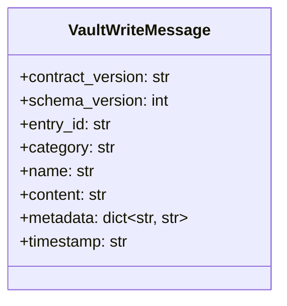
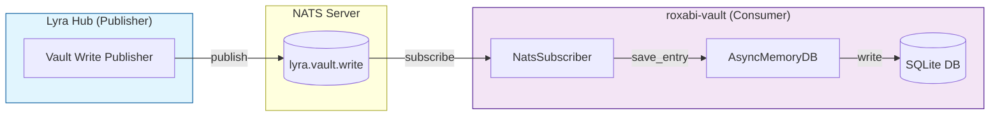

## Context

**Promoted from:** [Frame #27](../frames/27-adopt-roxabi-nats-sdk-frame.mdx)

Issue #24 describes NATS subscriber mode — consume vault writes from a bus rather than tight-coupled synchronous calls. Lyra extracted a shared NATS transport SDK (`roxabi-nats` v0.1.0) with standardized connection handling, contract versioning, and nkey auth.

This spec defines the vault-side subscriber implementation.

## Problem Statement

Current vault writes are triggered via synchronous calls from Lyra, creating:

- **Tight coupling** between Lyra and vault deployments
- **Single point of failure** — Lyra vault write failures block the caller
- **No retry/resilience mechanism** for transient failures

**Impact:** Lyra hub operators cannot independently upgrade vault without coordinating code changes. Deployment windows must align, and vault downtime blocks Lyra's vault-related features.

## Goal

Vault subscribes to vault write events from Lyra's NATS bus, enabling decoupled event-driven architecture.

## Users & Use Cases

| User | Story |
|------|-------|
| **Vault service** | As a subscriber, I process write events asynchronously so deployments decouple from Lyra |
| **Lyra hub** | As a publisher, I emit vault writes without waiting for storage confirmation |
| **Operators** | I configure NATS connection via env vars without code changes |

## Expected Behavior

### Happy path

1. Vault service starts, reads `NATS_URL`, `NATS_NKEY_SEED_PATH`, `NATS_SUBJECT` from environment
2. Instantiates `NatsSubscriber` with envelope name `"VaultWrite"`, schema version `1`
3. Calls `run(nats_url)` which connects via `nats_connect()` with nkey auth
4. SDK subscribes to configured subject with queue group `roxabi-vault`
5. Receives message with `contract_version: "1"` + `schema_version: 1` + vault payload
6. SDK validates contract + schema versions automatically
7. `handle()` processes payload — maps fields, calls `AsyncMemoryDB.save_entry()`
8. Acks message

### Edge cases

| Case | Handling |
|------|----------|
| Connection failure | SDK retries with exponential backoff (built-in) |
| Contract version mismatch | SDK logs warning, skips message |
| Schema version mismatch | SDK logs warning, skips message |
| Invalid payload schema | `handle()` catches, logs error with payload digest, skips |
| NATS server unavailable on startup | SDK retries until connected |
| Graceful shutdown | SDK drains subscriptions + closes connection on stop signal |

## Data Model & Consumers

### Message payload schema

### Consumer map

### Consumer summary

| Consumer | Fields consumed | When | Status |
|----------|----------------|------|--------|
| NatsSubscriber | All fields | On message receipt | This issue |
| AsyncMemoryDB | content, title, category, metadata | On handle() call | Existing code |

## Breadboard

### Code Affordances

| ID | Handler | Wiring | Logic |
|----|---------|--------|-------|
| N1 | `NatsSubscriber.__init__()` | Config → N1 | Set envelope_name="VaultWrite", schema_version=1, subject, queue_group |
| N2 | `NatsSubscriber.run()` | N1 → N2 | Call `nats_connect()`, subscribe, enter message loop |
| N3 | `NatsSubscriber.handle()` | N2 → N3 → A1 | Validate versions, map fields, call save_entry() |

### External Affordances (consumed)

| ID | Handler | Source | Purpose |
|----|---------|--------|---------|
| A1 | `AsyncMemoryDB.save_entry()` | roxabi_vault.async_db | Persist entry to SQLite |

### Field mapping (N3 → A1)

| Message field | `save_entry()` param | Transform |
|---------------|---------------------|-----------|
| `content` | `content` | pass-through |
| `name` | `title` | direct map |
| `category` | `category` | pass-through |
| `metadata` | `metadata` | pass-through |
| — | `type` | default: `"note"` |
| — | `namespace` | default: `"vault"` |

### Data Stores

| ID | Store | Type | Accessed by |
|----|-------|------|-------------|
| S1 | SQLite DB file | Persistent | A1 |

### Configuration

| Env Var | Required | Default | Description |
|---------|----------|---------|-------------|
| `NATS_URL` | Yes | — | NATS server URL (e.g., `nats://localhost:4222`) |
| `NATS_NKEY_SEED_PATH` | Yes | — | Path to nkey seed file |
| `NATS_SUBJECT` | No | `lyra.vault.write` | Subject to subscribe |

**Constructor params (not env vars):**

| Param | Value | Source |
|-------|-------|--------|
| `envelope_name` | `"VaultWrite"` | Fixed in code |
| `schema_version` | `1` | Fixed in code |
| `queue_group` | `"roxabi-vault"` | Fixed in code |

## Slices

| Slice | Description | Affordances | Demo |
|-------|-------------|-------------|------|
| V1 | Dependency + config | N1, A1 | `uv add roxabi-nats`, verify import, constructor params |
| V2 | Connection + subscription | N2 | Call `run()`, see subscription in logs |
| V3 | Message handling | N3, A1, S1 | Send test message, see entry stored in DB |
| V4 | Integration test | N1-N3, A1, S1, tests | docker-compose NATS fixture, full flow test |

## Constraints

- **Git dependency:** `roxabi-nats` via git source, tag-pinned to `roxabi-nats/v0.1.0`
- **Public API only:** Import from `roxabi_nats.__all__` only
- **nkey auth:** Required, use `NATS_NKEY_SEED_PATH` env var
- **Contract + schema version:** SDK validates both automatically
- **No direct `nats.connect()`:** Use SDK's `nats_connect()` (called internally by `run()`)

## Non-goals

- Publishing vault writes (Lyra-side responsibility per #703)
- Importing `_`-prefixed SDK internals
- Modifying roxabi-nats SDK
- WebSocket/HTTP fallback transports
- Horizontal scaling beyond queue groups (future consideration)

## Technical Decisions

| Decision | Choice | Rationale |
|----------|--------|-----------|
| Subject pattern | Configurable env var | Aligns with Lyra #703 evolution, flexible deployment |
| Default subject | `lyra.vault.write` | Follows Lyra `lyra.<domain>.<action>` convention |
| Error handling | SDK built-in retry | Resilient to transient failures, standard pattern |
| Test strategy | docker-compose NATS | Real integration test, no mocking complexity |
| Queue group | `roxabi-vault` (hardcoded) | Enables future horizontal scaling without duplicate processing |

## Success Criteria

- [ ] `pyproject.toml` declares `roxabi-nats` via git source, tag-pinned to `roxabi-nats/v0.1.0`
- [ ] `NatsSubscriber` class subclasses `NatsAdapterBase` with `envelope_name="VaultWrite"`, `schema_version=1`
- [ ] `handle()` implementation maps message fields to `AsyncMemoryDB.save_entry()`
- [ ] Connection established via `run(nats_url)` — SDK uses `nats_connect()` internally
- [ ] nkey auth via `NATS_NKEY_SEED_PATH` env var
- [ ] SDK validates `contract_version` + `schema_version` on inbound messages
- [ ] Subject configurable via `NATS_SUBJECT`, defaults to `lyra.vault.write`
- [ ] Integration test runs against docker-compose NATS fixture
- [ ] Issue #24 closed as implemented

## Open Questions

None — all ambiguities resolved.
