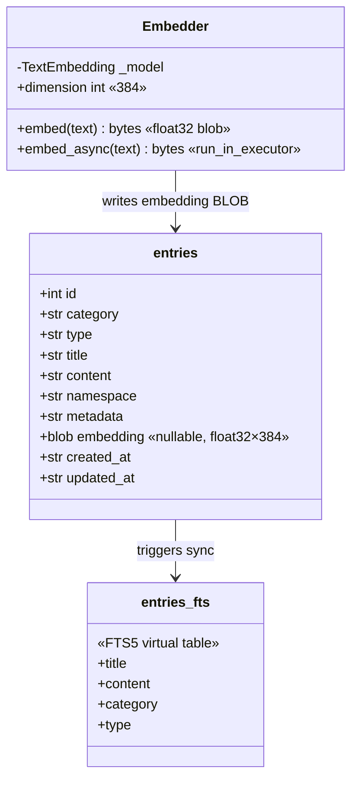
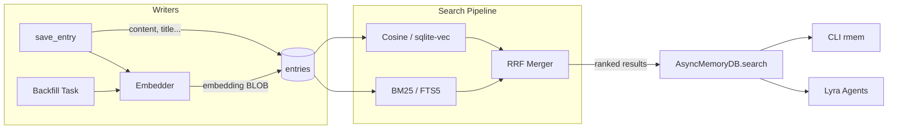

## Context

Promoted from [frame #7](../frames/7-hybrid-search-frame.mdx). Slice S3 of the Lyra memory layer.

Current search is BM25-only via FTS5 (`fts.py`). The `embedding BLOB` column exists in schema v2 and optional deps (`fastembed>=0.4`, `sqlite-vec>=0.1`) are declared in `pyproject.toml`, but no embedding or hybrid search code exists.

## Goal

Add `hybrid_search()` that combines BM25 keyword scores with cosine similarity from fastembed ONNX embeddings, returning a single ranked result list — without breaking existing BM25-only behavior for entries that lack embeddings.

## Users

- **Primary:** Lyra agents calling `AsyncMemoryDB.search()` — get better recall on conceptually similar content
- **Secondary:** Sync `MemoryDB` consumers — hybrid search available but embeddings optional

## Expected Behavior

1. **Startup:** When `AsyncMemoryDB` is created with `embeddings=True`, the fastembed ONNX model (`BAAI/bge-small-en-v1.5`, 384-dim) loads once. Without the flag, behavior is identical to today (BM25-only).

2. **Save:** `save_entry()` computes the embedding via `run_in_executor` and stores it as a float32 BLOB in the `embedding` column. If embeddings are disabled, the column stays NULL.

3. **Search:** `search()` runs both BM25 (FTS5) and cosine similarity (sqlite-vec `vec_distance_cosine`) queries, then merges results using Reciprocal Rank Fusion (RRF). Entries with `embedding IS NULL` participate in BM25 ranking only — their cosine rank is absent, so they receive a lower fused score but are never excluded.

4. **Backfill:** When a BM25 result has `embedding IS NULL` and embeddings are enabled, the entry is backfilled in the background (fire-and-forget `asyncio.create_task`). The current search result is not delayed.

5. **Graceful degradation:** If `fastembed` or `sqlite-vec` are not installed (optional deps), `AsyncMemoryDB(embeddings=True)` raises `ImportError` at init time with a clear message. Default `embeddings=False` always works.

6. **Extension loading:** When `embeddings=True`, `connect()` loads the sqlite-vec extension on the aiosqlite worker thread via `await self._db._execute(sqlite_vec.load, self._db._conn)`, placed after the PRAGMA calls. An `OperationalError` during extension load is caught and re-raised as `RuntimeError` with a clear message (e.g., "sqlite-vec extension failed to load — Python may lack extension support").

## Data Model & Consumers

### Data Structure



### Consumer Map



### Consumer Summary

| Consumer | Fields | When | Status |
|----------|--------|------|--------|
| BM25 search | title, content, category, type (via FTS5) | Every search query | Existing |
| Cosine search | embedding (via sqlite-vec) | Every search query (embeddings enabled) | This issue |
| RRF merger | BM25 rank + cosine distance | Every search query | This issue |
| save_entry | embedding (write) | Every insert (embeddings enabled) | This issue |
| Backfill task | embedding (write) | On NULL embedding found during search | This issue |
| Lyra agents | All fields via search results | Runtime | Existing |

## Breadboard

### Affordances

| ID | Element | Location |
|----|---------|----------|
| U1 | `AsyncMemoryDB(path, embeddings=True)` | `async_db.py` |
| U2 | `await db.search(query, namespace)` | `async_db.py` |
| U3 | `await db.save_entry(content, ...)` | `async_db.py` |

### Handlers

| ID | Handler | Triggered by |
|----|---------|-------------|
| N1 | `Embedder.embed_async(text)` | U3 (save), backfill |
| N2 | `_cosine_search(db, embedding, namespace, limit)` | U2 (search) |
| N3 | `_bm25_search(db, query, namespace, limit)` — delegates to `search_fts_async()` from `fts.py` | U2 (search) |
| N4 | `_rrf_merge(bm25_results, cosine_results, k=60)` | U2 (search) |
| N5 | `_backfill_entries(db, embedder, entry_ids)` | U2 (post-search) |

### Data Flow

| ID | Store / Query | Handler |
|----|--------------|---------|
| S1 | `INSERT embedding BLOB` | N1 → entries table |
| S2 | `SELECT ... WHERE entries_fts MATCH ?` | N3 → FTS5 |
| S3 | `SELECT ... WHERE embedding IS NOT NULL AND (...) ORDER BY vec_distance_cosine(embedding, ?)` | N2 → entries table + sqlite-vec |
| S4 | `UPDATE entries SET embedding = ? WHERE id = ?` | N5 → entries table |

## Implementation Notes

### Module boundary: `search.py` vs `fts.py`

`fts.py` is unchanged. The new `search.py` imports and calls `search_fts_async()` from `fts.py` for BM25 results — no reimplementation. `search.py` owns the cosine query, RRF merge, and `hybrid_search()` entry point.

### RRF formula

Reciprocal Rank Fusion with `k=60`:

```
score(d) = Σ_i  1 / (k + rank_i(d))
```

Where `rank_i(d)` is the **1-based ordinal position** of document `d` in result list `i` (not the raw FTS5 rank float or cosine distance). If `d` is absent from a list, it contributes 0 for that list.

### Sub-query candidate set sizing

Each sub-query (BM25 and cosine) fetches `limit × 2` candidates. RRF merges the union and returns the top `limit` results. This ensures sufficient overlap for meaningful fusion without excessive queries.

### `search()` method signature

Unchanged: `search(query, namespace, limit=5)`. Hybrid behavior is controlled solely by the `embeddings=True` init flag — no per-call override. This keeps the API surface minimal for F-lite.

### Backfill scope and lifecycle

- **Scope:** Only entries in the current BM25 result set with `embedding IS NULL` are backfilled — not the entire DB.
- **Batching:** One `asyncio.create_task` per search call, processing all NULL entries from that result set.
- **Error handling:** Backfill task catches all exceptions and logs them (`logging.warning`). Errors never propagate to the caller.
- **Close race:** `close()` does not await pending backfill tasks. A backfill writing to a closed connection logs a warning and exits silently. This is an accepted F-lite trade-off — backfill is best-effort.

### Embedder scope

Instance-scoped (one `Embedder` per `AsyncMemoryDB`). If two instances with `embeddings=True` exist in the same process, the ONNX model is loaded twice (~200MB each). This is a known trade-off; a process-level cache is out of scope.

### Out of scope (from frame)

- Model fine-tuning or custom training
- Multi-model support
- GPU acceleration
- Search result UI / CLI search enhancements
- Batch import / bulk embedding migration CLI command

## Slices

| # | Slice | Deliverable | Acceptance |
|---|-------|-------------|------------|
| 1 | Embedder module | `embeddings.py`: `Embedder` class with `embed()` and `embed_async()`. Loads ONNX model once. Returns float32 BLOB. | `embed("hello")` returns 384-dim float32 bytes; second call reuses model (no reload) |
| 2 | Cosine search + RRF | `search.py`: `hybrid_search()` with `_cosine_search` (filters `embedding IS NOT NULL`), `_bm25_search` (delegates to `fts.py`), `_rrf_merge`. sqlite-vec extension loaded. | Hybrid search returns merged ranking using ordinal RRF; NULL embeddings included via BM25-only; `limit` applies to final merged result |
| 3 | AsyncMemoryDB integration + backfill | Wire `Embedder` into `AsyncMemoryDB`. `save_entry` calls `embed_async()` on write. `search` uses hybrid. sqlite-vec loaded in `connect()`. Backfill NULL entries from result set. | Full round-trip: save → search → ranked results; after backfill task completes, previously-NULL entries have non-NULL embedding in DB |

## Success Criteria

- [ ] `hybrid_search()` returns merged ranking of BM25 + cosine similarity via RRF (ordinal position, k=60)
- [ ] `Embedder` loads fastembed ONNX model once at init, not per-call
- [ ] `Embedder.embed_async()` uses `run_in_executor` — asyncio event loop not blocked
- [ ] Rows with `embedding IS NULL` included in BM25 results, excluded from cosine query (`WHERE embedding IS NOT NULL`), no exception
- [ ] `AsyncMemoryDB(path, embeddings=True)` enables hybrid search; `embeddings=False` (default) preserves current BM25-only behavior
- [ ] `save_entry()` calls `embed_async()` (not sync `embed()`) and stores the resulting embedding when embeddings enabled
- [ ] Progressive backfill: after backfill task completes, previously-NULL entries have non-NULL embedding in DB. Backfill errors are logged, never propagated.
- [ ] `ImportError` with clear message if `fastembed`/`sqlite-vec` not installed and `embeddings=True`
- [ ] sqlite-vec extension loaded in `connect()` on the aiosqlite worker thread; `OperationalError` re-raised as `RuntimeError`
- [ ] `limit` parameter applies to the final merged result, not to individual sub-queries
- [ ] All existing tests pass unchanged (backward compatibility)
- [ ] New integration test exercises the full `embeddings=True` path: save → search → verify ranked results
